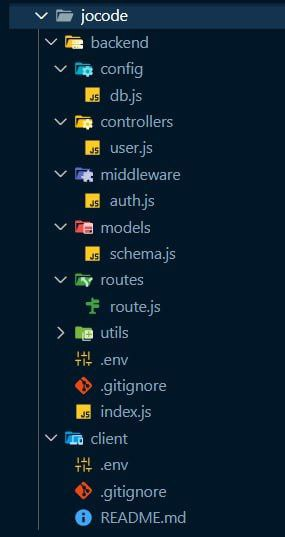

# jocode-create-folder

Create a full-stack folder setup in **1 second** 🚀

Stop wasting time creating folders and files every time you start a new project. With this CLI, your full-stack project structure is ready with a single command!

## Install globally

npm i -g jocode-create-folder

## once you install globally you can run create-folder command each time you need it.

create-folder

## Remote

npx jocode-create-folder

